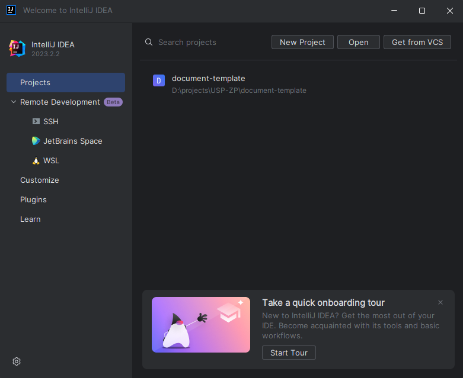
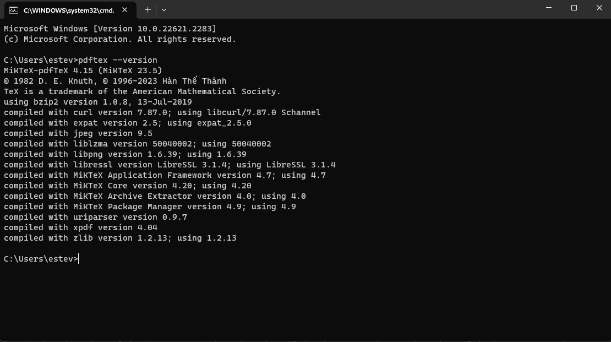
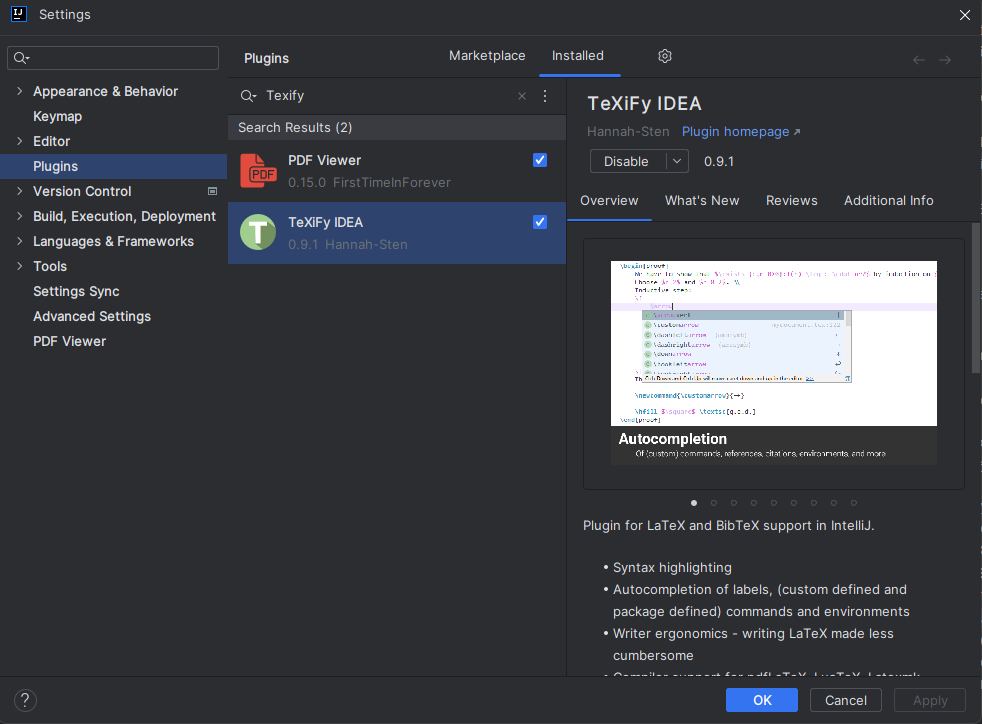
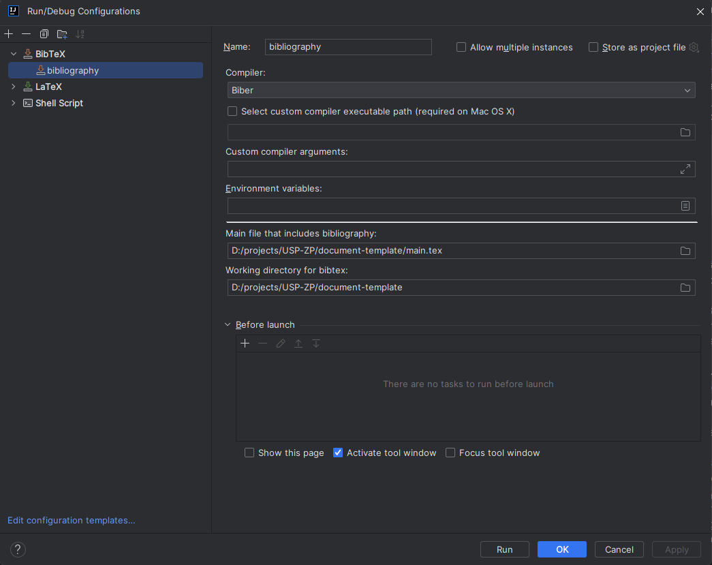
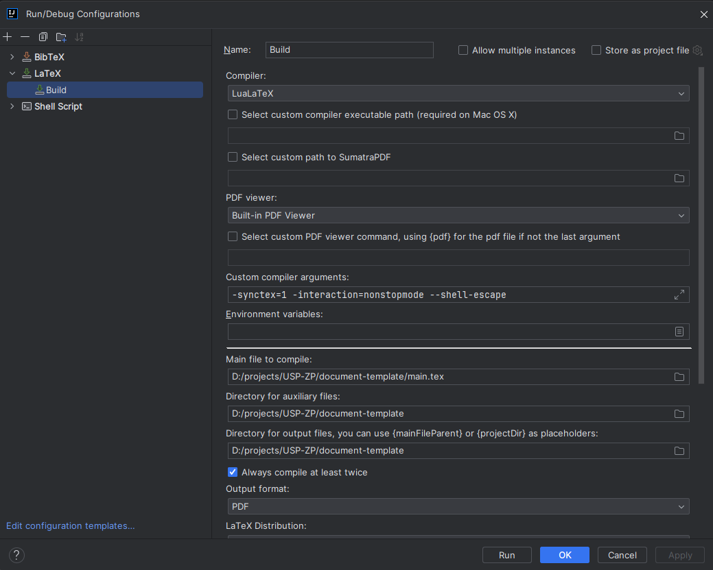

# USP-DOC: Template para documentos técnicos das USP

Modelos em LaTeX para documentos produzidos pela Unidade de Saúde Pública Zé-Povinho (ou para outras unidades).
Suporta estes tipos de documentos:

 - Documentos genéricos (facilmente modificáveis)
 - Recomendações
 - Procedimentos
 - Instruções de Trabalho
 - Listas de Verificação (checklists)

É possível também adicionar outros tipos de dcumentos e personalizar conforme as necessidades


## Copyright e Licença de Utilização

Este modelo foi criado por [Estêvão Soares dos Santos](https://github.com/tivie) e está sob a licensa MIT.

Esta licença permite a utilização, alteração e redistribuição (com ou sem alteraçõeS) do sistema,
de forma totalmente gratuita, mediante condições, entre as quais:
 - A licença seja mantida junto com o código fonte
 - As "copyright notices" tanto do código fonte como dos documentos gerados não sejam removidas

Para mais informação, consulte o ficheiro LICENSE distribuido com este repositório.

## Guia Rápido

Para uma explicação mais detalhada de todos os passos para instalar o ambiente LaTeX/Git, comece a ler a partir
do [Preâmbulo](#Preâmbulo)

### Iniciar um novo projecto

1. Na página do GitHub do projecto (https://github.com/USP-ZP/document-template) clique no botão verde
   `Use this template` e depois em `Create a new Repository`

2. Na nova página, configure o novo repositório da seguinte forma:
   - Em `Owner`, seleccione `USP-ZP`
   - Dê um nome ao repositório. Idealmente deve dar o nome correspondente ao número de série do documento.
     Ex: `R001.2023` para a Recomendação R001.2023 
   - Na descrição escreva o título do documento. Ex: `Identificação e abordagem a casos possíveis de hepatite no contexto
     do surto de Hepatite A na área geodemográfica do ACES Oeste Norte`
   - Selecione a opção `Private` para o repositório ser privado e só acessível
   
3. Ao clicar `Create Repository`, um novo repositório com o modelo LaTeX será criado.

4. Navegue até ao repositório recém-criado, clique no botão `Code` e no menu clique em `Open with Github Desktop`.
   Deverá aparecer uma mensagem informando que o browser está a tentar abrir uma aplicação. Aceite e a aplicação 
   "Github Desktop" deverá abrir com os dados do repositório

5. Na Aplicação "Github Desktop" selecione a directoria onde quer guardar o repositório e clique em `Ok`

Na pasta que selecionou encontra-se agora uma cópia do repositório criado, baseada neste modelo _LaTeX_

### Configurar o novo projecto

1. Abra o editor IntelliJ IDEA, usando o atalho no ambiente de trabalho.

2. Abra o repositório:

    - Se for a primeira vez que inicia o editor, deverá aparecer um quadro semelhante a este:
   
    

    - Clique em `Open` e navegue até ao diretório onde guardou o repositório. Seleccione essa pasta e clique em `OK`
   
    - Se já usou o IntelliJ IDEA anteriormente, carregue no icon de 
      menu ( ☰ ) > `File` > `New` > `Project from Existing Sources`

3. Siga as instruções para configurar o compilador presentes na secção deste guia intitulada
   ["Configurar o IntelliJ para Compilar Documentos LaTeX usando o Plugin TeXiFy IDEA"](#configurar-o-intellij-para-compilar-documentos-latex-usando-o-plugin-texify-idea)

4. Edite o ficheiro `config.yml`. Este ficheiro contém as configurações base do projecto, como tipo de projecto, título,
   autores, etc... Para mais informações, consulte a secção deste guia intitulada ["config.yml"](#conteudoconfigyml)

5. Clique em `Shift + F10`. O processo de compilação deverá iniciar. Quando terminado, deverá ter sido criado um documento
   PDF na pasta raiz do projecto.

### Editar o novo projecto

Para editar o projecto e escrever os conteúdos deverá editar os ficheiros dentro da pasta `conteudo`.
Cada uma das subpastas terá os ficheiros apropriados para cada tipo de documento. Por exemplo, se pretende criar uma
"Recomendação":

1. Editar o ficheiro `config.yml` e seleccionar o tipo de documento apropriado. Por exemplo, se pretender 
   escrever uma Recomendação, deve colocar o valor 2, sem aspas: 

    ```yml
    tipoDeDocumento: 2
    ```

2. Editar o resto do ficheiro `config.yml`, substituindo as informações pré-existentes pelas adequadas.

3. Tratando-se de uma recomendação, os ficheiros que devem ser editados para adicionar o conteúdo ao documento encontram-se
   dentro da pasta `conteudo/recomendacao`

4. Dentro da pasta `conteudo` também encontra outro ficheiro importante: `referencias.bib`. Este ficheiro contém as
   referencias que serão usadas como bibliografia do documento. Existem muitas ferramentas que permitem criar e exportar
   ficheiros `BibLaTeX` como o [Zotero](www.zotero.com) ou o [Mendeley](www.mendeley.com). Para mais instruções em como
   criar uma bibliografia, consulte a secção deste guia intitulada ["conteudo/referencias.bib"](#conteudoreferenciasbib)

5. A pasta `conteudo/anexos` funciona de maneira especial. Todos os ficheiros dentro desta serão incluidos na secção 
   "Anexos" do documento final. Se a pasta **for apgada**, a secção Anexos desaparece do documento final.
   Note que:
    - Cada anexo deve ser um ficheiro `.tex`. 
    - Os anexos são incluidos por ordem alfabética do nome ficheiro (e não do título do anexo). Ou seja, o ficheiro
      `aaa.tex` aparecerá sempre primeiro que o ficheiro `zzz.tex`, independentemente do título dado ao anexo.
    - **NÂO DEIXE A PASTA ANEXOS VAZIA, OU VAI DAR ERRO!** Se não quiser anexos no documento, então deverá
      **apagar a pasta**.
    - Para mais informações consulte a secção deste guia intitulada ["conteudo/anexos"](#conteudoanexos)

### Atualizar projecto pre-existente

Atualizar um documento pré-existente para a última versão deste _template_ é muito simples:

1. descarregue a nova versão (pode ser em formato zip)
2. copie todos os ficheiros e pastas do zip **à excepção da pasta `conteudo`**
3. cole esses ficheiros no seu projecto

Contudo, deverá tomar algumas precauções para garantir que o novo template funciona no seu documento antigo sem erros:

 - Certas versões têm "breaking changes", isto é, alterações no código fonte que necessitam de passos extra para
   funcionar com versões antigas.
 - Assim, leia as _release notes_ da versão e verifique se existem "breaking changes". Se existirem, siga os passos descritos
   para adaptar o seu docuemtno antigo á nova versão do template.
 - Como "regra de algibeira", as versões dentro da mesma "major version" (isto é, quando no número de versão, o primeiro
  algarismo se mantém 1.x.x) são compatíveis.
 - Versões em que a "major version" muda deverão ser imcompatíveis, e necessitam das adaptações descritas nas _release notes_.


---

## Preâmbulo

### Introdução ao LaTeX

_LaTeX_, pronunciado **"Lay-tech"** ou **"Lah-tech"**, é um sistema de preparação de documentos altamente especializado, 
baseado no programa de formatação TeX desenvolvido por Donald Knuth em 1978. Ao contrário dos tradicionais processadores 
de texto, como o Microsoft Word, o LaTeX não é um WYSIWYG (do inglês "What You See Is What You Get"); em vez disso, 
o autor utiliza comandos de marcação para definir a estrutura e o estilo do texto, enquanto o LaTeX trata do 
posicionamento e da formatação.

O LaTeX serve, predominantemente, para a produção de documentos técnicos e científicos, mas também é adequado para 
produzir cartas, CVs, livros e outros tipos de publicações. As suas capacidades tornam-no uma ferramenta de eleição, 
especialmente para trabalhos que envolvam fórmulas matemáticas complexas, referências cruzadas e bibliografias.

Em comparação com processadores de texto convencionais, o LaTeX oferece diversas vantagens. A sua abordagem baseada em 
comandos para formatação permite uma maior precisão e consistência ao longo de documentos extensos ou complexos. 
Adicionalmente, ao ser orientado por comandos, é possível focar no conteúdo sem se distrair com questões de "design" ou 
formatação.

Por último, mas não menos importante, os modelos de LaTeX realçam o seu poder. Existem modelos predefinidos para 
quase todos os tipos de documentos que alguém poderia querer produzir, desde teses académicas a apresentações. 
Estes modelos garantem um resultado profissional, mantendo, simultaneamente, a separação entre conteúdo e 
visualização. Isso facilita a manutenção e a edição de documentos, permitindo aos autores concentrarem-se no que 
realmente importa: o conteúdo.

Em suma, o LaTeX é uma ferramenta robusta e versátil que, embora tenha uma curva de aprendizado inicial, 
oferece benefícios significativos em termos de precisão, consistência e flexibilidade na produção de documentos.

### Introdução ao Markdown e a sua Integração com LaTeX

O Markdown é uma linguagem de marcação leve criada em 2004 por John Gruber, com colaboração de Aaron Swartz, desenhada 
para ser fácil de ler e de escrever. Ao contrário de linguagens de marcação mais complexas, como o HTML ou o próprio 
LaTeX, o Markdown foi desenvolvido com o intuito de ter uma sintaxe simples e intuitiva, que pode ser lida como texto 
sem formatação, mas que, quando interpretada, é convertida numa formatação rica.

A principal função do Markdown é facilitar a escrita de conteúdo para a "web", permitindo aos autores criar documentos 
formatados usando uma sintaxe de texto simples. É frequentemente usado para escrever mensagens em fóruns, 
documentação de código, blogues e outros.

Um dos aspetos mais interessantes do Markdown, no que diz respeito à produção de documentos mais elaborados, é a sua 
compatibilidade com o LaTeX. Existem pacotes específicos que permitem integrar o Markdown diretamente em documentos 
LaTeX. Esta integração oferece a possibilidade de combinar a simplicidade e legibilidade do Markdown com o poder e 
precisão do LaTeX, criando um ambiente híbrido de redação.

As vantagens inerentes ao Markdown, tais como a sua simplicidade e legibilidade, tornam-no uma escolha atrativa para 
quem procura escrever rapidamente sem se preocupar excessivamente com comandos ou formatações complicadas. Ao usá-lo 
em conjunto com o LaTeX, o autor beneficia das funcionalidades avançadas deste último, como a gestão de referências, 
fórmulas matemáticas e estruturação de documentos extensos, enquanto mantém a possibilidade de redigir partes do texto 
de forma mais fluida e direta com o Markdown.

Em resumo, enquanto o Markdown serve como uma ferramenta eficaz para criar conteúdo formatado de forma simples e direta, 
a sua integração com o LaTeX amplia ainda mais as possibilidades de produção de documentos, combinando o melhor de dois 
mundos: simplicidade e poder.

### Introdução ao Git e a sua Aplicação na Gestão de Documentos em LaTeX

O Git é um sistema de controlo de versões distribuído, criado por Linus Torvalds em 2005. Esta ferramenta foi 
desenvolvida para auxiliar na gestão e rastreio de alterações em código-fonte durante o desenvolvimento de "software", 
mas, ao longo dos anos, tem-se mostrado útil para uma variedade mais ampla de aplicações, incluindo a gestão de 
documentos e projetos de escrita.

A principal função do Git é permitir que múltiplos utilizadores colaborem num projeto, mantendo um histórico completo 
de todas as alterações. Este histórico, ou "log", é essencial para entender o desenvolvimento de um projeto, revertendo 
para versões anteriores se necessário, e resolvendo conflitos quando duas ou mais pessoas fazem alterações simultâneas 
no mesmo ficheiro.

Na gestão de documentos em LaTeX, o Git revela-se uma ferramenta de valor inestimável. Primeiramente, o LaTeX, ao ser 
baseado em texto puro, é altamente compatível com sistemas de controlo de versões, como o Git. Assim, qualquer 
alteração no conteúdo, por mínima que seja, pode ser rastreada com precisão. Esta capacidade traz consigo várias 
vantagens:

* **Versionamento**: Com o Git, cada alteração feita num documento LaTeX é registada. Isso permite que os autores voltem a 
qualquer ponto no histórico do documento, facilitando a revisão e recuperação de versões anteriores.

* **Colaboração**: Se vários autores estiverem a trabalhar num documento LaTeX, o Git facilita a colaboração, permitindo que 
cada autor trabalhe no documento simultaneamente. As alterações podem ser posteriormente combinadas, e eventuais 
conflitos resolvidos manualmente.

* **"Backup" e Distribuição**: O Git, ao ser um sistema distribuído, permite que cada colaborador tenha uma cópia completa do 
histórico do projeto. Isto não só proporciona redundância e segurança, mas também facilita a partilha e distribuição 
do documento entre várias partes.

Em resumo, o Git é uma ferramenta poderosa que, quando combinada com o LaTeX, oferece uma solução robusta para a gestão, 
colaboração e versionamento de documentos. Esta combinação assegura que o desenvolvimento de um documento seja 
organizado, rastreável e, sobretudo, colaborativo.

---

## Pré-requesitos

Para poder utilizar modelos em _LaTeX_ é necessário instalar as seguintes ferramentas:

  - Uma distribuição _LaTeX_. Aconselhamos usar o [MiKTeX para Windows][MiKTeX]
  - Um editor, para editar os ficheiros. O [IntelliJ IDEA Community Edition][intjIdea] com um plugin para 
    _LaTeX_ é uma boa opção
  - Um cliente Git, como o [Github “Desktop”][ghd]. Este cliente vem com o Git e com um visualziador de respositórios

## Instalação dos pré-requesitos

### MiKTeX

O MiKTeX é uma distribuição LaTeX popular para o sistema operativo Windows. Ele fornece todos os pacotes e ferramentas 
necessários para criar, editar e compilar documentos _LaTeX_. Siga os passos abaixo para instalar o MiKTeX no Windows.
Estas instruções funcionam para os computadores de serviço.

1. **Aceder ao Site Oficial**:
    - Abra o seu navegador e vá para o site oficial do MiKTeX: [https://miktex.org/][MiKTeX].

2. **Download**:
    - Na página principal, clique em "Download" ou procure pela secção de "downloads".
    - Escolha a versão apropriada para o seu sistema operativo Windows (64-bit).

3. **Executar o Instalador**:
    - Uma vez descarregado o ficheiro, localize-o na pasta de "downloads" e faça duplo clique no ficheiro `.exe` para 
      iniciar o processo de instalação.

4. **Assistente de Instalação**:
    - O assistente de instalação do MiKTeX irá iniciar. Clique em "Next" ou "Seguinte".
    - Escolha a opção de instalação "Only for me" (apenas para o utilizador atual). Clique em "Next" ou "Seguinte".
    - Aceite a opção padrão para o diretório de instalação do MiKTeX. A opção padrão é geralmente adequada para a 
      maioria dos utilizadores. Clique em "Next" ou "Seguinte".
    - No ecrã seguinte, escolha a opção que permite ao MiKTeX descarregar os pacotes LaTeX em falta automaticamente.
      Esta opção é útil, pois o LaTeX tem muitos pacotes e nem todos estão incluídos na instalação básica.
      Clique em "Next" ou "Seguinte".
    - Escolha o repositório de pacotes mais próximo da sua localização geográfica. Isso garantirá "downloads" mais 
      rápidos quando novos pacotes forem necessários.

5. **Instalação**:
    - Clique em "Start" ou "Iniciar" para começar a instalação. O processo pode demorar algum tempo, dependendo da sua 
      conexão à "internet" e do desempenho do seu computador.

6. **Conclusão**:
    - Uma vez concluída a instalação, clique em "Next" ou "Seguinte" e, finalmente, em "Close" ou "Fechar" 
      para finalizar o assistente.

7. **Verificar a Instalação**:
    - Pode verificar se o MiKTeX foi instalado corretamente ao pesquisar "MiKTeX Console" no menu iniciar do Windows 
      e abrir a aplicação.
    - Deve verificar também que o MiKTeX está acessível ao sistema. Para isso:
        - Clique em `Tecla do Windows + R` e escreva cmd. CLique `Ok`
        - Na Linha de Comandos escreva `pdftex --version` e clique na tecla `Enter`. Se o MiKTeX foi bem instalado, 
          deverá aparecer uma informação semelhante a esta:
          
          

### GitHub Desktop

O "Github Desktop" instala automaticamente o Git bem como um cliente para visualizar repositórios.

1. **Aceder ao Site Oficial do GitHub Desktop**:
   - Abra o seu navegador e dirija-se ao site oficial do GitHub Desktop:
     [https://desktop.github.com/](https://desktop.github.com/).

2. **Download**:
   - Clique no botão `Descarregar para Windows` (ou um botão semelhante) para começar a descarregar o instalador.

3. **Localizar o Ficheiro Descarregado**:
   - Vá à pasta de descargas do seu computador (geralmente denominada "Downloads").
   - Procure o ficheiro descarregado, que deverá ter um nome como `GitHubDesktopSetup.exe` ou similar.

4. **Iniciar o Processo de Instalação**:
   - Faça duplo clique no ficheiro `.exe` que descarregou para iniciar o processo de instalação.

5. **Seguir o Assistente de Instalação**:
   - O GitHub Desktop possui um processo de instalação bastante direto. Simplesmente siga as instruções no ecrã, 
     clicando em `Seguinte` (ou um botão semelhante) quando solicitado.
   - Se lhe forem apresentadas opções durante a instalação, como e onde instalar o "software", selecione de acordo com 
     as suas preferências. O local padrão geralmente serve para a maioria dos utilizadores.

6. **Conclusão da Instalação**:
   - Uma vez concluído o processo de instalação, clique no botão `Concluir` (ou semelhante). O GitHub Desktop poderá 
     iniciar automaticamente ou poderá necessitar de iniciar o programa manualmente.

7. **Iniciar o GitHub Desktop**:
   - Se o programa não iniciar automaticamente após a instalação, procure o ícone do GitHub Desktop no seu ambiente de
     trabalho ou no menu Iniciar e clique nele para abrir o programa.

8. **Configurar a sua Conta**:
   - Na primeira vez que abrir o GitHub Desktop, será solicitado que inicie sessão com a sua conta GitHub.
     Se já possuir uma conta, insira as suas credenciais. Se não, terá a opção de criar uma conta.


### IntelliJ IDEA Community Edition no Windows sem Acesso de Administrador

Embora o processo padrão de instalação do IntelliJ IDEA no Windows requeira permissões de administrador, 
é possível contornar esta restrição e instalar o "software" mesmo sem essas permissões.

1. **Aceder ao Site Oficial da JetBrains**:
    - Abra o seu navegador e vá para o site oficial da JetBrains, especificamente a página de downloads do 
      IntelliJ IDEA: [https://www.jetbrains.com/idea/download/][intjIdea].

2. **Download**:
    - Na secção "Windows", escolha o instalador `.exe` sob "Community".
    - Clique nessa opção para descarregar o instalador.

3. **Iniciar o Processo de Instalação**:
    - Localize o instalador descarregado na sua pasta de "downloads" e faça duplo clique no ficheiro `.exe` para iniciar
      o processo de instalação.

4. **Contornar o Pop-up de Administrador**:
    - Durante a instalação, se aparecer o pop-up a pedir permissões de administrador, clique em "Cancelar".
    - A instalação deverá continuar mesmo após cancelar o pedido de permissões.

5. **Configurações de Instalação**:
    - Quando o assistente de instalação aparecer, escolha a localização predefinida (deverá ser a pasta pessoal do utilizador)
    - Configure as restantes opções conforme a sua preferência e continue o processo de instalação.
      (pode manter as opções predefinidas)

6. **Conclusão da Instalação**:
    - Depois de configurar todas as opções, prossiga com a instalação. Uma vez concluída, terá o IntelliJ IDEA instalado 
      na localização que escolheu. Um atalho deverá ter sido criado no seu ambiente de trabalho.

7. **Executar o IntelliJ IDEA**:
    - Pode iniciar o IntelliJ IDEA a partir do atalho criado no ambiente de trabalho ou na localização de instalação 
     que escolheu.


### Plugins TeXiFy IDEA e PDF Viewer no IntelliJ IDEA Community Edition

Estes dois plugins permitem trabalhar e visualizar mais facilmente documentos _LaTeX_ no IntelliJ IDEA. 

1. **Abrir o IntelliJ IDEA**:
   - Inicie o IntelliJ IDEA Community Edition a partir do atalho no ambiente de trabalho ou a partir do menu Iniciar.

2. **Aceder às Configurações**:
   - No canto superior direito da janela principal do IntelliJ IDEA, clique no ícone de engrenagem (⚙️) ou vá a 
     `Ficheiro` > `Configurações` (ou use o atalho `Ctrl` + `Alt` + `S`).

3. **Navegar até ao Gestor de Plugins**:
   - Na janela de configurações que se abre, no painel esquerdo, clique em `Plugins`.

4. **Procurar pelo Plugin TeXiFy IDEA**:
   - Na parte superior da janela de plugins, encontrará uma barra de pesquisa. Digite "TeXiFy IDEA" e pressione `Enter`.
   - Deverá ver o plugin "TeXiFy IDEA" listado nos resultados da pesquisa.
   
     

5. **Instalar o Plugin TeXiFy IDEA**:
   - Clique no plugin "TeXiFy IDEA" nos resultados da pesquisa para selecioná-lo.
   - Clique no botão `Apply` co canto inferior direito da janela.

6. **Procurar pelo Plugin PDF Viewer**:
   - Na mesma barra de pesquisa, agora digite "PDF Viewer" e pressione `Enter`.
   - Deverá ver o plugin "PDF Viewer" listado nos resultados da pesquisa.

7. **Instalar o Plugin PDF Viewer**:
   - Clique no plugin "PDF Viewer" nos resultados da pesquisa para selecioná-lo.
   - Clique no botão `Apply` co canto inferior direito da janela.

8. **Reiniciar o IntelliJ IDEA**:
   - Depois de instalar os plugins, geralmente é recomendado reiniciar o IntelliJ IDEA para garantir que os plugins 
     sejam corretamente integrados. Deverá ver um botão `Reiniciar IDE` ou `Reiniciar` no canto inferior direito.
     Clique nele para reiniciar.


## Configuração

### Configurar o IntelliJ para Compilar Documentos LaTeX usando o Plugin TeXiFy IDEA

1. **Criar um Novo Projeto "Empty Project"**:
    - Inicie o IntelliJ IDEA.
    - Abra um projecto.
    - Pode escolher um projecto baseado neste modelo que tenha ou criar um novo. Caso queria criar um projecto de teste:
        - Selecione `Novo Projeto`. 
        - Escolha "Empty Project" e clique em `Next`.
        - Dê um nome ao seu projeto e selecione um diretório para o mesmo. Depois clique em `Finish`.

2. **Criar um Documento LaTeX Básico**:
   - Caso seja um projecto pré-existente, passe para o passo 3. 
   - No diretório raiz do projeto, crie um novo ficheiro chamado `main.tex`.
   - Insira o seguinte código básico:

   ```latex
   \documentclass{article}

   \begin{document}
   Olá, mundo LaTeX!
   \end{document}
   ```

3. **Configurar o BibTeX com biber**:
   - No menu superior ( ☰ ), clique em `Run` > `Edit Configurations`.
   - Clique no sinal de adição (+) e selecione `BibTeX`.
   - No campo "Name", escreva `Bibliografia`
   - Em "BibTeX compiler", selecione `biber`.
   - No campo "Main file", selecione o ficheiro `main.tex`.
   - No campo "Working directory for BiBTex", selecione a pasta base do projecto
     (onde o ficheiro `main.tex` está localizado)
   - Clique em `Apply` apra guardar as alterações
   - 

4. **Criar Configuração para LuaLaTeX**:
   - Ainda na janela `Edit Configurations`, clique novamente no sinal de adição (+) e selecione `LaTeX`.
   - Dê o nome "Build" à configuração.
   - Em "Compiler", selecione `LuaLaTeX`.
   - Em "PDF viewer", selecione `Built-in PDF Viewer` (este visualizador foi instalado com o plugin PDF Viewer).
   - Em "Custom compiler arguments", insira: `-synctex=1 -interaction=nonstopmode --shell-escape`.
   - No campo "Main file to compile", selecione o ficheiro `main.tex`.
   - Em "Directory for auxiliary files" e "Output directory", use `{projectDir}` para definir o diretório raiz do
     projeto como local para esses ficheiros.
   - Marque a opção `Always compile at least twice`.
   - Em "Extensions", clique em "> External LaTeX programs", clique em "+" e adicione a configuração do BiBTex criada
     anteriormente.
   - 

5. **Guardar e Compilar**:
   - Clique em `OK` para guardar as configurações.
   - No painel à esquerda, clique com o botão direito do rato no ficheiro `main.tex`, 
     e selecione `Run Build`

Se as configurações estiverem correctas, deverá aparecer um ficheiro PDF chamado `main.pdf` com o 
conteúdo "Olá, mundo LaTeX!"

NOTA: Esta configuração deverá ser repetida para todos os projectos.

---

## Linguagem LaTeX

O LaTeX é uma linguagem de marcação amplamente usada para produção de documentos com alta qualidade tipográfica. 
A linguagem permite a criação de artigos, relatórios, teses, livros, entre outros, com um elevado grau de 
personalização.

1. **Formatação de texto**:
   - *Itálico*: `\textit{texto em itálico}`
   - **Negrito**: `\textbf{texto em negrito}`
   - Sublinhado: `\underline{texto sublinhado}`

2. **Introdução de imagens**:
    Para incluir imagens no seu documento, primeiro, é necessário carregar o pacote `graphicx` no preâmbulo do seu documento:
    ```latex
    \usepackage{graphicx}
    ```
   
   Em seguida, pode inserir imagens com o seguinte comando:
    ```latex
    \includegraphics[width=0.5\linewidth]{nome_do_ficheiro}
    ```
   Neste exemplo, a imagem ocupará metade da largura da linha. Pode ajustar o parâmetro `width` conforme necessário.

3. **Tabelas**:
   Para criar uma tabela, pode usar o ambiente `tabular`. Aqui está um exemplo simples de uma tabela com duas colunas:
    ```latex
    \begin{tabular}{|c|c|}
    \hline
    Cabeçalho 1 & Cabeçalho 2 \\
    \hline
    Dado 1,1 & Dado 1,2 \\
    Dado 2,1 & Dado 2,2 \\
    \hline
    \end{tabular}
    ```

4. **Listas**:
   - **Listas Desordenadas**:
     ```latex
     \begin{itemize}
         \item Primeiro item
         \item Segundo item
         \item Terceiro item
     \end{itemize}
     ```

   - **Listas Ordenadas**:
     ```latex
     \begin{enumerate}
         \item Primeiro item
         \item Segundo item
         \item Terceiro item
     \end{enumerate}
     ```

5. **Linhas Horizontais**:
   Pode inserir uma linha horizontal com o comando `\hrulefill` ou simplesmente `\hline` dependendo do contexto.

6. **Cabeçalhos e Subcabeçalhos (Sections)**:
    ```latex
    \section{Cabeçalho principal}
    Algum texto.

    \subsection{Subcabeçalho}
    Mais texto.

    \subsubsection{Sub-subcabeçalho}
    Ainda mais texto.
    ```

7. **Tabela de Conteúdos (TOC)**:
   Pode inserir uma Tabela de Conteúdos com o comando `\tableofcontents`. O LaTeX irá gerar automaticamente uma TOC com base nos comandos de secção (\section, \subsection, etc.) que usou no seu documento.

8. **Bibliografia**:
   Existem vários métodos para adicionar referências bibliográficas no LaTeX, mas o básico é usar o ambiente `thebibliography`:
    ```latex
    \begin{thebibliography}{9}
    \bibitem{nome1} Autor 1. \textit{Título do Livro 1}. Editora, Ano.
    \bibitem{nome2} Autor 2. \textit{Título do Livro 2}. Editora, Ano.
    \end{thebibliography}
    ```

    Para projetos maiores, é aconselhável usar o BibTeX ou o BibLaTeX, que permitem que as referências sejam mantidas num ficheiro `.bib` separado. Estes ficheiros contêm entradas bibliográficas estruturadas que podem ser citadas no seu documento principal.

    Um exemplo de uma entrada num ficheiro `.bib` pode ser:
    ```latex
    @book{key,
      author = "Nome do Autor",
      title = "Título do Livro",
      publisher = "Editora",
      year = "Ano de Publicação"
    }
    ```

    No seu documento principal, após ter citado as referências com o comando `\cite{key}`, pode imprimir a bibliografia usando:
    ```latex
    \printbibliography
    ```

   Certifique-se de incluir no preâmbulo do seu documento o pacote correspondente (seja `biblatex` ou outros relacionados 
   com BibTeX) e de especificar o caminho do ficheiro `.bib`.


## Linguagem Markdown

Markdown é uma linguagem de marcação leve que é usada para criar documentos formatados usando um texto simples. 
Suporta vários tipos de blocos de texto e formatações, das quais se apresenta um resumo seguidamente:


- **Parágrafos**: Para criar um parágrafo de texto basta dar dois enters no fim da linha.

    ```md
    Primeiro paragrafo
    de texto!
   
    Segundo parágrafo de texto.
    ```

- **Cabeçalhos**: Pode criar cabeçalhos usando o símbolo `#`. O número de `#` determina o nível do cabeçalho.

    ```md
    # Cabeçalho 1
    
    ## Cabeçalho 2
    
    ### Cabeçalho 3
    
    #### Cabeçalho 4
    
    ##### Cabeçalho 5
    
    ###### Cabeçalho 6
    ```

- **Ênfase**:

    ```md
    *texto em itálico* ou _texto em itálico_
   
    **texto em negrito** ou __texto em negrito__
   
    **_texto em negrito e itálico_** ou *__texto em negrito e itálico__* ou ***texto em negrito ou italico***
   
    ~~texto riscado~~
    ```

- **Listas**:

    - **Listas ordenadas**: As listas ordenadas consistem num número seguido de um ponto e um espaço (`1. `)
        
        ```md
        1. Primeiro item
        2. Segundo item
        3. Terceiro item
        ```

        Também é possível criar listas cujos items têm o espaçamento de um parágrafo entre eles, deixando uma linha
        em branco entre os items:
        
        ```md
        1. Primeiro item
        
        2. Segundo item
        
        3. Terceiro item
        ```

    - **Listas não ordenadas**: As listas não ordenadas consistem numa marca de lista (`-`, `*`, ou `+`) 
      seguida de espaço:
  
        ```md
        - Item
        * Item
        + Item
        ```

    - **Sublistas**: É também possível criar sublistas (ordenadas ou não ordeandas ou mistas).
        Para isso basta dar 4 espaços (ou um TAB) desde o início da linha

        ```md
        1. era uma vez
            - um gato
            - um cão
            - piriquito
        2. maltês
        3. que tocava piano e
            1. falava francês
            2. falava chinês
                1. Mandarim
                2. Cantonês
            3. falava japonês
        4. fim
        ```

- **Links**: Links podem ser criados com o um texto entre parentesis rectos seguido do endereço (urt) entre parentesis 
  curvos.

    ```md
    [Isto é um link](https://www.google.com)
    ```

- **Imagens**: Imagens seguem uma sintaxe semelhante aos links, mas com um ponto de exclamação no início.

    ```md
    
    ```

- **Citações**: Use `>` para criar citações:

    ```md
    > Isto é uma citação.
    ```

- **Linhas horizontais**: Pode usar três ou mais hífens, asteriscos ou sublinhados:

    ```md
    ---
    ***
    ___
    ```

- **Tabelas**: Tabelas podem ser formatas seguindo este exemplo. Podem ter as linhas e as colunas que se desejar. E não necessitam
    de estar formatadas direitinho.

    ```md
    |   Cabeçalho 1  |   Cabeçalho 2  |
    |----------------|----------------|
    | linha 1, col 1 | linha 1, col 2 |
    | linha 2, col 1 | linha 2, col 2 |
    ```

- **Ignorando a formatação Markdown**:

    Se quiser mostrar um caracter especial de Markdown, pode usar o `\` antes:
    
    ```md
    \* isto não será formatado como itálico \*
    ```

---

## Estrutura do modelo USP-DOC

O modelo está dividido em várias pastas e ficheiros. Os mais importantes são apresentados abaixo.

### main.tex

### conteudo/*

### conteudo/config.yml

### conteudo/referencias.bib

### conteudo/anexos/


[MiKTeX]: https://miktex.org/
[intjIdea]: https://www.jetbrains.com/idea/download/
[ghd]: https://desktop.github.com/
